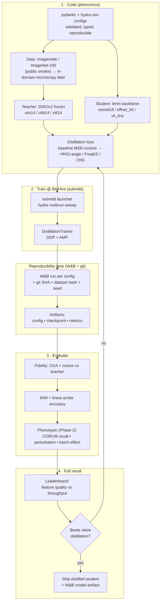

# Phenomica master roadmap — code → full result

End-to-end map from the codebase to a publishable distillation result, with a
reproducibility lane (W&B + git) running underneath every stage.

## Reading the diagram
- **Stage 1 (Code)** is the merged `pydantic + hydra-zen` config feature: every run
  is a typed, validated, CLI-overridable config — the foundation for reproducible sweeps.
- **Stage 2 (Train)** fans the config matrix out to BioHive via submitit; one SLURM
  job per config (hydra multirun).
- **Reproducibility lane** is not a stage but a cross-cut: every training run logs a
  W&B run stamped with git SHA + dataset hash + seed, and uploads config + checkpoint
  + metrics as W&B artifacts, so any result is re-runnable from its lineage.
- **Stage 3 (Eval)** measures *feature quality*, not just loss: CKA/cosine fidelity to
  the teacher, kNN + linear-probe accuracy now; phenotypic metrics (Phase 2).
- **Stage 4 (Result)** ranks students by quality-vs-throughput and asks the core
  question — does an enriched objective beat naive MSE distillation? If not, the loop
  feeds back to the loss-design stage.

See `experiment-design.md` for the matrix, eval suite, compute, and reproducibility
contract; `beyond-distillation.md` for the research synthesis behind the loss choices.
